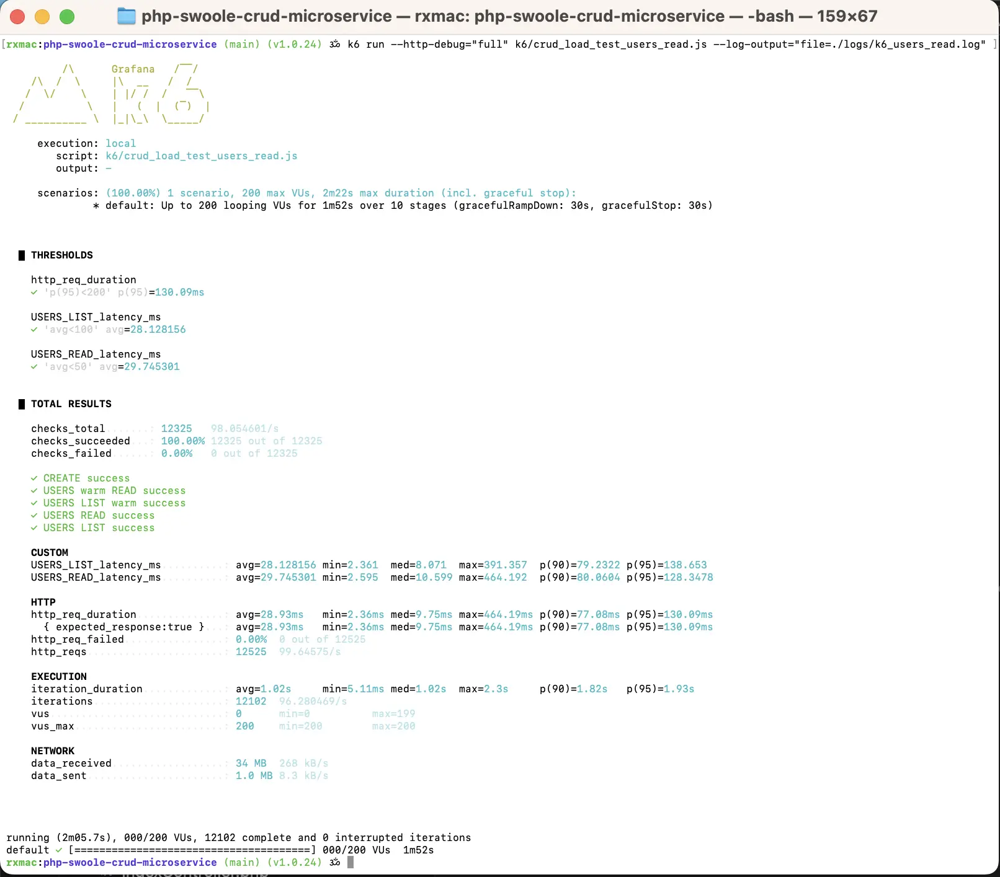
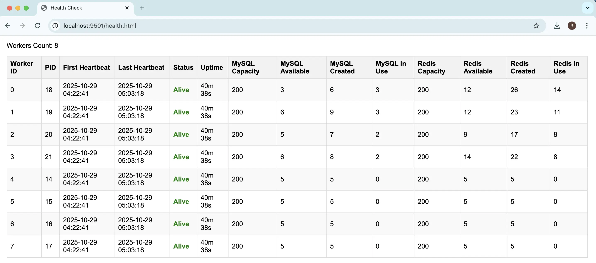
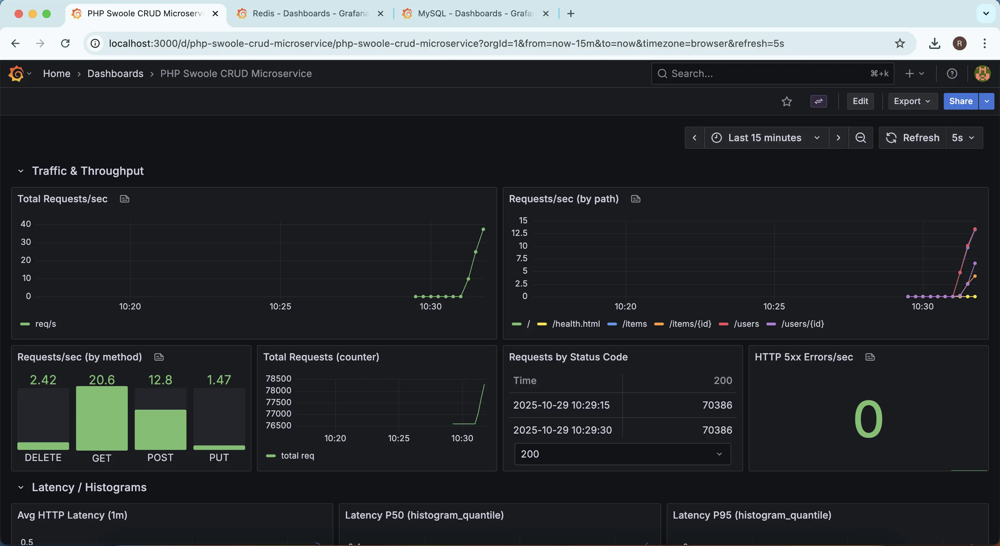
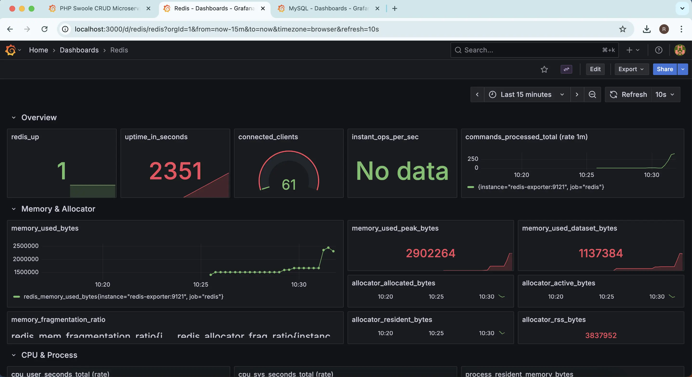
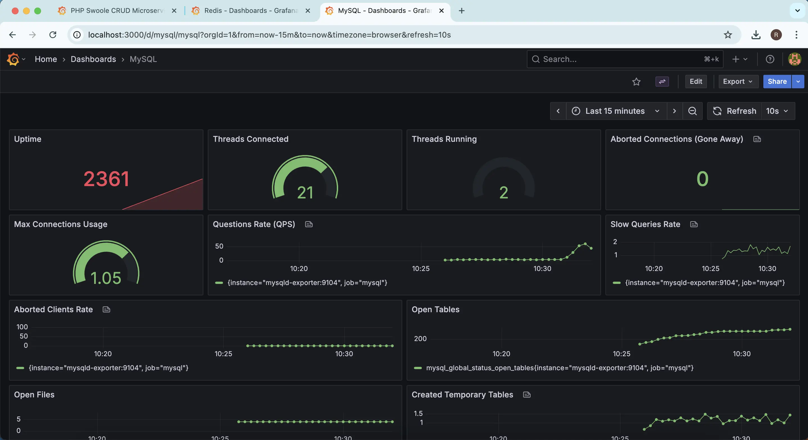

# PHP Swoole CRUD Microservice

A high-performance **PHP CRUD microservice** built with **Swoole**, featuring **MySQL**, **Redis**, **Prometheus**, **Grafana**, **Caddy**, and **Swagger UI** integration. Designed for **scalable**, **observable**, and **containerized** deployments.

By 🐼 [Ramakant Gangwar](https://github.com/rxcod9)


# ⚙️ Swagger / OpenAPI


# ⚡️ Performance


# ❤️ Health


# 📊 Grafana Dashboards





[](https://github.com/rxcod9/php-swoole-crud-microservice/releases)

[](https://packagist.org/packages/rxcod9/php-swoole-crud-microservice)

---

## 🚀 Features

- ⚡️ Fast HTTP server powered by **Swoole**
- 🗄️ MySQL database with **connection pooling**
- 🔁 Redis caching and pooling
- 📈 Prometheus metrics endpoint
- 📊 Grafana dashboards for monitoring
- 🔐 **Caddy** for HTTPS and reverse proxy
- 📘 Swagger UI for API documentation
- ❤️ Health checks for all services

---

## 🏁 Getting Started

### 🧰 Prerequisites

**Docker** & **Docker Compose**

### 🐳 Docker Hub Quick Start

If you prefer using the pre-built Docker image, follow these steps:

```bash
# 1️⃣ Prepare environment file
# Copy the example .env file (you can modify it to match your setup)
cp .env.example .env
```

```bash
# Example .env values
APP_ENV=production
APP_DEBUG=false

DB_HOST=mysql
DB_PORT=3306
DB_USER=root
DB_PASS=secret
DB_NAME=app_db

REDIS_HOST=redis
REDIS_PORT=6379

PROMETHEUS_PORT=9502
SWOOLE_HTTP_PORT=9501
```

Now run the container:

```bash
# 🐙 Pull the latest image
docker pull rxcod9/php-swoole-crud-microservice:v1.0.24

# 🚀 Run the container with .env file
docker run --env-file .env -d -p 9501:9501 --name php-crud-microservice rxcod9/php-swoole-crud-microservice

# 🧩 Run database migrations inside the running container
docker exec -it php-crud-microservice php scripts/migrate.php
```

### 🧩 Docker Compose Usage

This repository includes a `docker-compose.yml` to run the full stack:

```bash
# ▶️ Start all services (PHP app, MySQL, Redis, Prometheus, Grafana, Caddy)
docker compose up -d --build

# ⏹️ Stop all services
docker compose down

# 📜 View logs
docker compose logs -f
```

Edit `.env` or `docker-compose.override.yml` to customize ports and database credentials.

### ⚡️ Quick Start

```bash
# 📋 Copy example environment
cp .env.example .env

# 📦 Install PHP dependencies
composer install

# 🚀 Start all services in detached mode
docker compose up -d --build
```

### 🗄️ Database Migration

```bash
# 🧭 Run migrations inside the app container
docker compose exec app php scripts/migrate.php
```

### 📘 API Documentation

```bash
# 🧩 Generate OpenAPI spec
php bin/generate-swagger.php
```

Access Swagger UI at [http://localhost:8080](http://localhost:8080)

---

## 🧠 Example API Usage

```bash
# ➕ Create a user
curl -s -X POST http://localhost:9501/users     -H 'Content-Type: application/json'     -d '{"name":"alice","email":"alice@example.com"}'

# 📚 Get all users
curl -s -X GET http://localhost:9501/users -H 'Content-Type: application/json' | jq

# 🔍 Get a user by ID
curl -s -X GET http://localhost:9501/users/1 -H 'Content-Type: application/json' | jq

# 🔎 Get a user by email
curl -s -X GET http://localhost:9501/users/email/alice%40example.com -H 'Content-Type: application/json' | jq

# ✏️ Update a user
curl -i -X PUT http://localhost:9501/users/1     -H 'Content-Type: application/json'     -d '{"name":"alice-updated","email":"alice-updated@example.com"}'

# ❌ Delete a user
curl -i -X DELETE http://localhost:9501/users/1 -H 'Content-Type: application/json'
```

---

## ⚙️ Benchmarking

```bash
# 🧪 Using k6
k6 run --http-debug="full" k6 run k6/tests/crud_load_test.js > logs/k6.log 2>&1

# k6 command with all possible ENV variables
k6 run \
    -e BASE_URL=http://localhost:9501 \
    -e ENTITIES=users,items \
    -e CRUD=list,read,create,update \
    -e TOTAL_ENTITIES=200 \
    -e HOT_PERCENT=0.3 \
    -e COOL_PERCENT=0.3 \
    -e TOTAL_EXECUTIONS=2000 \
    -e MAX_VUS=50 \
    -e MAX_DURATION=10m \
    --http-debug="full" \
    tests/crud_main_test.js > logs/k6.log 2>&1

# 🧩 Using ApacheBench
ab -n 100000 -c 100 -v 4 http://localhost:9501/users/1 2>&1 | tee ab.log
```

---

## 📡 Monitoring

- 📈 **Prometheus** scrapes metrics from the app, MySQL exporter and Redis Exporter.
- 📊 **Grafana** visualizes metrics (default port: `3000`).

---

## ⚙️ Environment Variables

All configurable options are defined in `docker-compose.yml` and `.env.example`.

---

## 🧾 License

MIT
