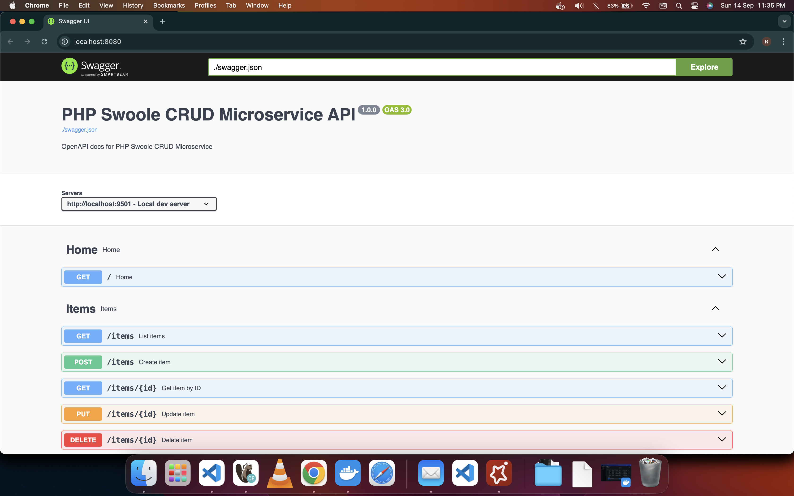

# php-swoole-crud-microservice

## Overview

A high-performance CRUD microservice built with PHP and Swoole, featuring MySQL, Redis, Prometheus, Grafana, Caddy, and Swagger UI integration. Designed for scalable, observable, and containerized deployments.

## Features

- Fast HTTP server powered by Swoole
- MySQL database with connection pooling
- Redis caching and pooling
- Metrics endpoint for Prometheus
- Grafana dashboards for monitoring
- Caddy for HTTPS and reverse proxy
- Swagger UI for API documentation
- Health checks for all services

## Getting Started

### Prerequisites

- Docker & Docker Compose

### Quick Start

```bash
# Install composer
composer install

# Start all services in detached mode
docker compose up -d --build
```

### Database Migration

```bash
# Run migrations inside the app container
docker compose exec app php scripts/migrate.php
```

### API Documentation

```bash
# Generate OpenAPI spec
php bin/generate-swagger.php
```

Visit Swagger http://localhost:8080



### Example API Usage

```bash
# Create a user
curl -s -X POST http://localhost:9501/users \
    -H 'Content-Type: application/json' \
    -d '{"name":"alice","email":"alice@example.com"}'

# Get all users
curl -s -X GET http://localhost:9501/users -H 'Content-Type: application/json' | jq

# Get a user by ID
curl -s -X GET http://localhost:9501/users/1 -H 'Content-Type: application/json' | jq

# Get a user by Email
curl -s -X GET http://localhost:9501/users/email/alice%40example.com -H 'Content-Type: application/json' | jq

# Update a user
curl -i -X PUT http://localhost:9501/users/1 \
    -H 'Content-Type: application/json' \
    -d '{"name":"alice-updated","email":"alice-updated@example.com"}'

# Delete a user
curl -i -X DELETE http://localhost:9501/users/1 -H 'Content-Type: application/json'
```

### Benchmarking

```bash
# Run k6 
k6 run --http-debug="full" k6/crud_load_test_real.js > logs/k6_real.log 2>&1
# OR
k6 run --http-debug="full" k6/crud_load_test_read.js > logs/k6_read.log 2>&1
# OR
k6 run --http-debug="full" k6/crud_load_test.js > logs/k6.log 2>&1

# Run ApacheBench
ab -n 100000 -c 100 -v 4 http://localhost:9501/users/1 2>&1 | tee ab.log
```

### Monitoring

- Prometheus scrapes metrics from the app and MySQL exporter.
- Grafana visualizes metrics (default port: 3000).

### Environment Variables

See `docker-compose.yml` for all configurable options.

## License

MIT